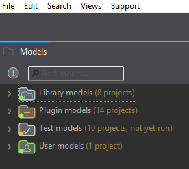
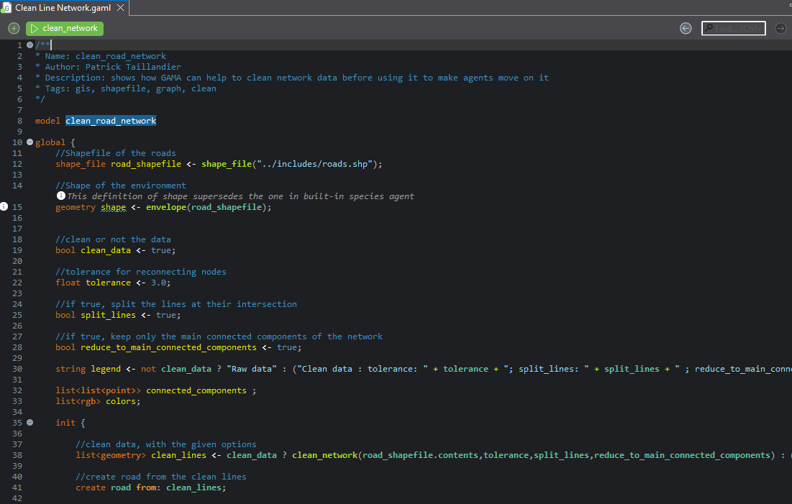
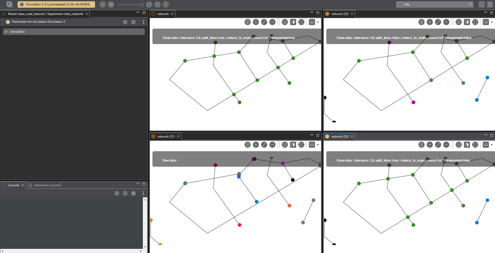
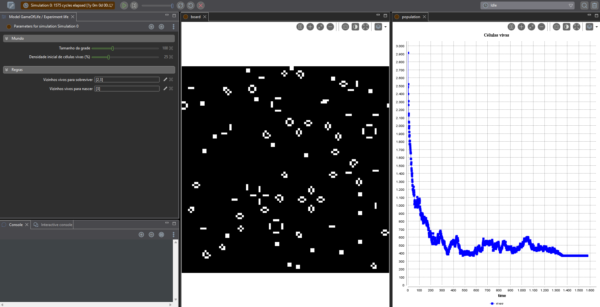
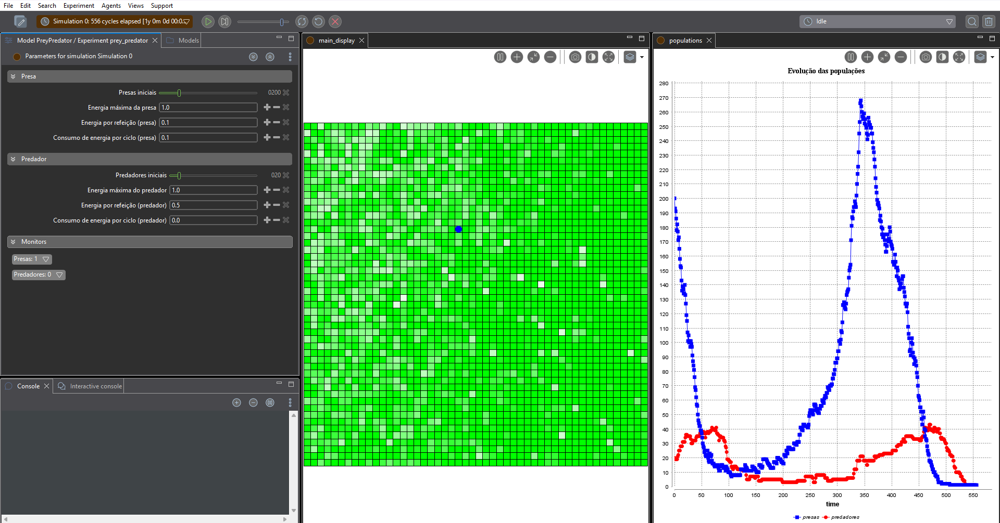
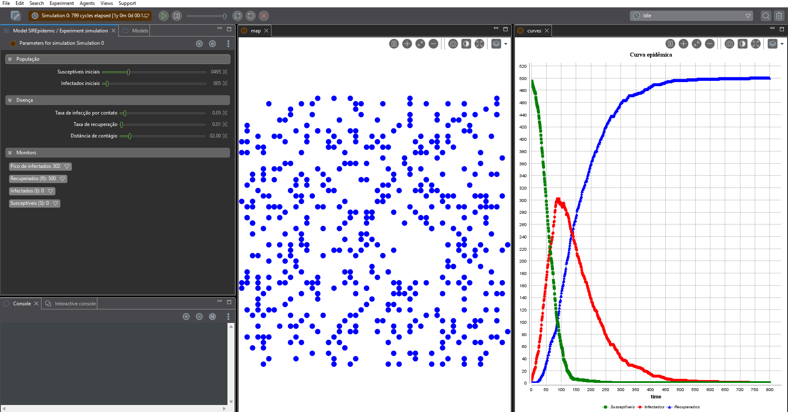

# Guia GAMA Platform

[← Voltar ao índice](../../README.md) · [Guia NetLogo](../netlogo/guias.md)

## Sumário

- [Download da Ferramenta](#download-da-ferramenta)
- [Edições e Modos de Execução](#edições-e-modos-de-execução)
- [Guia de Uso](#guia-de-uso)
- [Configuração](#configuração)
- [Primeiros Passos](#primeiros-passos)
  - [Estrutura Básica](#estrutura-básica)
  - [Código Exemplo](#código-exemplo)
- [Modelos Comentados](#modelos-comentados)
- [Documentação Oficial](#documentação-oficial)

## Download da Ferramenta

Baixe o GAMA no [site oficial](https://gama-platform.org/download).

A partir da versão **2025-06**, o GAMA abandonou a numeração tradicional (1.8, 1.9.3) e passou a nomear as versões pela data de lançamento (ex.: `GAMA_2025.06.4`). O instalador já inclui o JDK necessário, portanto não é preciso instalar o Java separadamente.

## Edições e Modos de Execução

O GAMA é distribuído como um **único pacote** (Windows, macOS Intel, macOS Apple Silicon e Linux). O que varia é o modo como esse pacote é executado:

- **GAMA Desktop (interface gráfica)**
  Modo padrão, com interface baseada no Eclipse IDE. Usado para modelagem, execução interativa e análise visual.

- **Modo Headless**
  Execução por linha de comando, sem interface gráfica, para simulações em lote ou em servidores (foco em alto desempenho e HPC). Não é um download à parte: os scripts `gama-headless.bat` (Windows) e `gama-headless.sh` (macOS/Linux) ficam na pasta `headless` da própria instalação.

- **gama-server**
  Uma forma específica de execução headless que abre um servidor WebSocket, recebendo comandos em JSON para carregar modelos, executar, pausar e avançar ciclos remotamente. É o caminho para integrar o GAMA a outros softwares ou a interfaces web. Inicia-se pelo mesmo script headless, ex.: `gama-headless -socket 6868`.

## Guia de Uso

A interface principal do GAMA é dividida em diferentes perspectivas e visualizações, herdadas da estrutura do Eclipse:

- **Navigator (Model Library):** Fica na lateral esquerda. É o gerenciador de arquivos onde ficam os seus projetos (`User models`) e a biblioteca de exemplos do GAMA, separada em `Library models`, `Plugin models` e `Test models`.



- **Editor:** A área central onde o código na linguagem GAML (GAMA Modeling Language) é escrito. Inclui preenchimento automático, destaque de sintaxe e detecção de erros em tempo real. Acima do código ficam os botões verdes que executam cada `experiment` declarado no arquivo.



- **Interface de Simulação (Views):** Quando um modelo é executado, a perspectiva muda. Esta área exibe os monitores (Displays), inspetores de agentes, parâmetros interativos e gráficos. Cada simulação aberta ganha suas próprias views, o que permite comparar lado a lado execuções com parâmetros diferentes.



## Configuração

Diferente do NetLogo, no GAMA não existe uma janela de configurações: a configuração espacial e temporal é feita via código no bloco `global`, e a configuração da interface é feita no bloco `experiment`.

- **Topologia (Geometry):** O formato e o tamanho do mundo são definidos no bloco `global` através do atributo `shape`. Por padrão, o mundo é um quadrado de 100 m de lado. Pode ser redefinido como outra geometria ou importado de um arquivo shapefile (GIS):

  ```gaml
  global {
      geometry shape <- square(200 #m);
  }
  ```

  A forma final do mundo será sempre o retângulo envolvente (*envelope*) da geometria informada.

- **Limites do mundo:** Atenção — diferente do NetLogo, um agente do GAMA **não é impedido de sair do mundo**. Se o ambiente não for um toro, é preciso restringir o deslocamento explicitamente (por exemplo, com o facet `bounds:` das ações de movimento), ou os agentes simplesmente se afastam da área visível.

- **Passo de Tempo (Step):** O atributo global `step` define o tempo que cada ciclo representa. O padrão é 1 segundo:

  ```gaml
  global {
      float step <- 1 #h;   // cada ciclo equivale a uma hora
  }
  ```

- **Parâmetros:** São definidos declarando variáveis no bloco `global` e vinculando-as à diretiva `parameter` no bloco do experimento, o que as expõe como campos editáveis na interface.

## Primeiros Passos

Para entender a estrutura do GAMA, o fluxo recomendado é iniciar pelos modelos embutidos.

- **Acessar a Biblioteca:** No painel lateral esquerdo (Navigator), expanda a pasta `Models`. Os modelos estão categorizados por temas (Toy Models, Epidemiology, Urban, etc.).
- **Carregar um Modelo:** Dê um duplo clique no arquivo `.gaml` desejado para abri-lo no Editor.
- **Executar:** Acima do editor, ou dentro da própria árvore de arquivos, localize e clique no botão verde com ícone de engrenagem referente ao experimento configurado no código.
- **Controle de Simulação:** A interface mudará para o modo simulação. Utilize os botões de "Play" (para rodar continuamente), "Step" (avanço manual de um ciclo) e "Pause" localizados na barra superior.
- **Alterar parâmetros:** Os valores digitados no painel de parâmetros só são lidos quando a simulação é **inicializada**. Depois de mudar um deles, clique em **"Reload"** (a seta circular, ao lado do Play) para recriar a simulação com os novos valores.

### Estrutura Básica

O código GAML é modular e estritamente estruturado em seções fundamentais.

- **Global:** É o núcleo da simulação. Define as condições iniciais (bloco `init`), variáveis globais de estado do modelo, o limite do ambiente geográfico e dinâmicas que afetam todo o sistema. Funciona como o observador e as configurações iniciais juntas.

- **Species:** Representam os agentes no GAMA. Cada espécie define atributos (variáveis), ações (métodos executáveis), reflexos (comportamentos automáticos em cada ciclo) e aspectos (como os agentes são desenhados na tela).

  Uma ação que devolve valor é declarada com o tipo de retorno antes do nome e **sem parênteses**; a chamada, por outro lado, leva parênteses:

  ```gaml
  float energy_from_eat {          // declaração: sem ()
      return 0.5;
  }

  reflex eat {
      energy <- energy + energy_from_eat();   // chamada: com ()
  }
  ```

  Declarar a ação como `float energy_from_eat() { ... }` é erro de compilação no GAMA 2025-06. Vale conferir esse detalhe ao copiar código da internet: as versões em desenvolvimento (2026.x) passaram a aceitar os parênteses também na declaração, e os modelos publicados no branch `main` do repositório oficial já usam essa forma nova.

- **Skills:** Módulos de comportamento pré-programados anexados a uma espécie pelo facet `skills:`. Cada skill acrescenta atributos e ações prontas. A skill `moving`, por exemplo, adiciona os atributos `speed`, `heading` e `destination` e as ações `move`, `goto`, `follow` e `wander`. **Sem anexar a skill, essas ações não existem na espécie** — é a causa de erro mais comum para quem vem do NetLogo, onde o movimento já é embutido em toda turtle.

- **Grid:** Uma espécie especial de agentes estacionários, semelhante aos "patches" do NetLogo. Criam matrizes de células com tamanho fixo que podem ter atributos dinâmicos e interagir com agentes móveis.

- **Experiment:** Define como o modelo será visualizado e testado. É aqui que você cria botões, expõe parâmetros para o usuário na interface gráfica e define os blocos de `output` (gráficos e mapas de exibição).

### Código Exemplo

O paradigma do GAMA separa rigidamente a estrutura (variáveis), o comportamento (reflexos) e a visualização (aspectos e experimentos).

Abaixo, um modelo funcional e minimalista de caminhada aleatória (random walk):

```gaml
model RandomWalk

// 1. Bloco Global: o mundo e a inicialização
global {
    int nb_walkers <- 100;                // parâmetro exposto no experimento

    init {
        create walker number: nb_walkers; // cria os agentes da espécie walker
    }
}

// 2. Bloco Species: definição dos agentes móveis
//    skills: [moving] concede os atributos speed/heading e a ação wander
species walker skills: [moving] {
    rgb color <- #red;                    // atributo de cor

    init {
        speed <- 1.0;                     // distância percorrida por ciclo
    }

    // Comportamento executado a cada ciclo
    reflex move {
        do wander bounds: world;          // movimento aleatório, restrito ao mundo
    }

    // Visualização do agente
    aspect default {
        draw circle(1) color: color;
    }
}

// 3. Bloco Experiment: interface gráfica
experiment RandomWalkExp type: gui {
    parameter "Número de agentes" var: nb_walkers min: 1 max: 1000;

    output {
        display map_view {
            species walker aspect: default; // desenha a espécie com o aspecto padrão
        }
    }
}
```
[Arquivo no Repositório](../../models/gama/basic/random_walk.gaml)

## Modelos Comentados

Os modelos abaixo estão em [`models/gama/`](../../models/gama/) como arquivos `.gaml` prontos para abrir no GAMA. Cada arquivo traz um cabeçalho com a explicação geral do modelo, um comentário de apresentação antes de cada bloco e um comentário por linha de código. A ordem é progressiva: cada modelo assume o que foi visto no anterior.

| Modelo | Nível | O que introduz |
| --- | --- | --- |
| [Random walk](../../models/gama/basic/random_walk.gaml) (comentado [acima](#código-exemplo)) | Básico | `species`, skill `moving`, `reflex`, `aspect`, `experiment` |
| [Jogo da Vida](../../models/gama/basic/game_of_life.gaml) | Básico | `grid`, vizinhança, atualização síncrona, mundo em toro |
| [Presa-Predador](../../models/gama/advanced/prey_predator.gaml) | Avançado | Herança entre espécies, interação entre agentes, ciclo de vida, gráficos |
| [Epidemia SIR](../../models/gama/advanced/sir_epidemic.gaml) | Avançado | Máquina de estados, mecanismos de recuperação, contágio espacial, experimento `batch`, exportação CSV |

---

**[Jogo da Vida](../../models/gama/basic/game_of_life.gaml)** — Autômato celular de Conway. Enquanto o *random walk* apresenta os agentes móveis, este apresenta a outra metade do mundo do GAMA: os agentes estacionários do `grid`, equivalentes aos *patches* do NetLogo. O ponto central é a **atualização síncrona**: as regras precisam valer para todas as células ao mesmo tempo, então o ciclo é dividido em duas fases — o bloco `global` manda todas calcularem o próximo estado, e só depois cada célula o aplica. Aplicar a regra de imediato, célula a célula, produziria um modelo diferente. Na captura abaixo, a curva conta a história do modelo: a população despenca de ~2900 células vivas nos primeiros ciclos, quando as configurações aleatórias instáveis morrem em massa, e se estabiliza em torno de 380 — o que sobra são as estruturas estáveis e os osciladores visíveis no tabuleiro.



---

**[Presa-Predador](../../models/gama/advanced/prey_predator.gaml)** — Cadeia alimentar em três camadas: a vegetação cresce nas células da grade, as presas a consomem e os predadores comem as presas. Todos gastam energia, morrem sem ela e se reproduzem dividindo a própria energia com os filhotes. Traz três mecanismos novos: **herança e polimorfismo** (presa e predador compartilham uma espécie-mãe e sobrescrevem apenas como se alimentam e para onde vão), **interação direta entre agentes** (o predador ordena que uma presa morra) e **ciclo de vida** (agentes nascem e morrem durante a execução, não só no `init`). O gráfico mostra o comportamento característico do modelo: as oscilações defasadas das duas populações.

Na captura, o gráfico mostra o comportamento esperado: as presas (azul) crescem, os predadores (vermelho) crescem atrás delas, o excesso de predadores derruba as presas e a queda das presas derruba os predadores — duas oscilações completas e defasadas ao longo de ~550 ciclos. A extinção no fim não é defeito do modelo: em um modelo baseado em agentes as populações são números inteiros e pequenos, então uma sequência azarada de mortes pode zerar uma das espécies sem que nada no modelo esteja errado. É a diferença entre a simulação por agentes e as equações de Lotka-Volterra, que oscilam para sempre porque tratam a população como número contínuo. Para corridas mais longas, aumente a grade e as populações iniciais: quanto maiores os números, menor o peso do acaso.

> **Por que o movimento dirigido é essencial neste modelo.** É tentador fazer presas e predadores caminharem ao acaso, como no *random walk* — mas aí o modelo não funciona. O predador tem energia para cerca de 25 ciclos sem comer, e com 200 presas espalhadas por 2500 células a chance de cair por acaso em uma célula ocupada é de apenas ~8% por ciclo: os predadores são extintos nos primeiros ciclos, antes que qualquer dinâmica apareça. Por isso cada espécie implementa uma ação `choose_cell` — a presa vai à célula com mais alimento, o predador vai a uma célula que contenha presas, ambos dentro de um raio de 2 células. É um bom exemplo de como, em modelos baseados em agentes, a regra de percepção e busca costuma pesar mais no resultado do que os parâmetros numéricos.



---

**[Epidemia SIR](../../models/gama/advanced/sir_epidemic.gaml)** — Os indivíduos circulam pela grade e passam por três estados, S → I → R, sem volta. O contágio não é uma equação global: cada encontro entre um susceptível e um infectado é um sorteio independente, e a curva epidêmica emerge daí. O modelo demonstra ainda que **a ordem dos reflexos dentro de uma espécie é a ordem de execução** — a recuperação é declarada antes do contágio para que ninguém adoeça e se cure no mesmo ciclo. Mais importante, o mesmo arquivo define **dois experimentos**: um `gui`, para observar, e um `batch`, que roda 125 simulações sem abrir janela alguma, varrendo combinações de parâmetros e gravando os indicadores em CSV. É a transição de construir um modelo para usá-lo como instrumento de medida, e o caminho natural para o [modo headless](#edições-e-modos-de-execução).



A captura mostra uma corrida completa com os valores padrão: o pico chega a 302 infectados simultâneos por volta do ciclo 100, e no fim os 500 indivíduos estão imunes — taxa de ataque de 100%.

#### Todos precisam se infectar?

Não. Que a corrida acima tenha atingido 100% da população é consequência dos parâmetros escolhidos, não uma regra do modelo SIR — e vale entender por quê, porque é o cerne do que o modelo tem a ensinar.

O que decide o desfecho é o **número básico de reprodução (R₀)**: quantas pessoas, em média, um único infectado contamina enquanto está doente, numa população inteiramente susceptível. Ele é o produto de três coisas: quantos contatos o infectado tem por ciclo, a chance de cada contato transmitir, e por quantos ciclos ele segue transmitindo.

Na configuração padrão, cada agente tem cerca de 2,5 vizinhos dentro do raio de contágio, a transmissão é de 0,05 por contato e a doença dura ~100 ciclos: R₀ ≈ 2,5 × 0,05 × 100 ≈ **12**. Um valor altíssimo — para efeito de comparação, o sarampo, das doenças humanas mais contagiosas, fica entre 12 e 18. Com R₀ nessa faixa, a epidemia varre a população inteira.

A teoria epidemiológica dá a fração final atingida em função apenas do R₀, pela *equação do tamanho final*:

| R₀ | Fração da população que adoece |
| --- | --- |
| 1,2 | 31% |
| 1,5 | 58% |
| 2 | 80% |
| 3 | 94% |
| 5 | 99% |
| 12 | ~100% |

Repare que **mesmo com R₀ alto a fração nunca chega matematicamente a 100%** — sempre há quem escape por sorte, nunca tendo cruzado com um infectado. Com 500 agentes e R₀ = 12, porém, o número esperado de sortudos é menor que um, e o resultado arredonda para todo mundo. Abaixo de R₀ = 1 acontece o oposto: a epidemia se apaga nos primeiros ciclos, deixando quase todos intactos.

Ou seja: para que apenas parte da população adoeça, é preciso baixar o R₀ — menos contato, menor transmissão por contato ou **menos tempo transmitindo**. É por isso que o experimento em lote varre justamente `infection_rate` × `infection_duration`: a varredura cobre R₀ de ~0,25 a ~22, atravessando o limiar de 1, e a coluna `attack_rate_pct` mostra a transição entre a epidemia que não sai do lugar e a que atinge todos.

#### Duração definida ou sorteio a cada ciclo?

| | Duração definida (`true`, padrão) | Sorteio por ciclo (`false`) |
| --- | --- | --- |
| Regra | Cura ao completar `infection_duration` ciclos | A cada ciclo, `flip(recovery_rate)` |
| Distribuição da duração | Concentrada em torno da média | Geométrica: muitos casos curtos, cauda longa |
| Realismo | Alto — uma gripe dura alguns dias | Baixo — implica que curar-se "não tem memória" |
| Por que existe | Comportamento observado nas doenças reais | É a hipótese embutida no SIR clássico de equações diferenciais, que a adota por conveniência matemática |

Um detalhe de implementação importa: com duração rigorosamente fixa, todos os contaminados no mesmo ciclo se curariam juntos, gerando ondas artificiais de sincronia. Por isso cada agente sorteia a própria duração entre 80% e 120% do valor definido — variação suficiente para dessincronizar, sem devolver a cauda irrealista do sorteio.

O ponto a reter é que **trocar o mecanismo mantendo a mesma duração média não muda muito a fração final atingida** — que depende sobretudo do R₀ — mas muda a *forma* da curva: com duração definida a epidemia é mais sincronizada, o pico é mais alto e mais estreito. Quem quiser ver a diferença pode rodar as duas com `infection_duration` 100 e `recovery_rate` 0.01, que têm exatamente a mesma média.

#### Lendo o CSV do experimento em lote

O lote grava uma linha por simulação em `models/gama/advanced/results/sir_batch_results.csv`, no formato *tidy*: uma observação por linha, uma variável por coluna, primeiro o que identifica a corrida, depois os parâmetros testados e por último os resultados.

| Coluna | O que é | Como usar |
| --- | --- | --- |
| `sim_id` | Número da simulação dentro da varredura | Distingue as 5 repetições de uma mesma combinação |
| `infection_rate` | Probabilidade de transmissão por contato | Parâmetro testado |
| `infection_duration` | Ciclos que o agente passa transmitindo | Parâmetro testado |
| `transmission_index` | `infection_rate × infection_duration` | Potencial de transmissão de um infectado ao longo de toda a doença — é o produto que governa o desfecho |
| `duration_cycles` | Ciclos até a parada | Duração da epidemia |
| `ended_naturally` | `true` = acabou sozinha; `false` = truncada no teto de 500 ciclos | **Filtre antes de tirar médias** |
| `peak_infected` | Maior número de infectados simultâneos | Gravidade — pico de pressão sobre o sistema |
| `peak_cycle` | Ciclo em que o pico ocorreu | Rapidez — quanto tempo houve para reagir |
| `final_immune` | Imunizados ao fim | Quantos passaram pela doença |
| `total_infected` | `final_immune + infectados restantes` | Alcance absoluto |
| `attack_rate_pct` | % da população que adoeceu | Alcance relativo — compara corridas de tamanhos diferentes |


## Documentação Oficial

- [GAMA Platform Documentation](https://gama-platform.org/wiki/Home)
- [GAML Reference](https://gama-platform.org/wiki/GamlReference)
- [Built-in Skills](https://gama-platform.org/wiki/BuiltInSkills) — lista de skills, seus atributos e ações
- [The global species](https://gama-platform.org/wiki/GlobalSpecies) — configuração do mundo (`shape`, `torus`, `step`)
