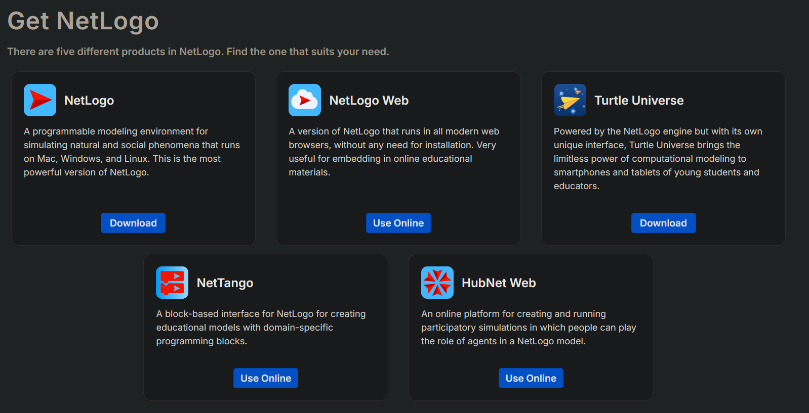

# Guia NetLogo

## Sumário
- [Download da Ferramenta](#download-da-ferramenta)
- [Versões Disponíveis](#versões-disponíveis)
- [Guia de Uso](#guia-de-uso)
- [Configuração](#configuração)
- [Primeiros Passos](#primeiros-passos)

## Download da Ferramenta
Baixe o NetLogo no [site oficial](https://ccl.northwestern.edu/netlogo/download.shtml).

## Versões Disponíveis

* **NetLogo Desktop**
  Versão padrão em formato de software, executada localmente.

* **[NetLogo Web](https://www.netlogoweb.org/launch)**
  Versão web do NetLogo padrão, executada diretamente do navegador.

* **[Turtle Universe](https://www.turtlesim.com/products/turtle-universe/)**
  Versão mobile. Permite aprender fenômenos sociais e científicos através de representações interativas e micro mundos.

* **[NetTango](https://ccl.northwestern.edu/nettangoweb/)**
  Interface baseada em blocos para o NetLogo Web. Focada na criação de modelos educacionais com blocos de programação específicos.

* **[HubNet Web](https://hubnetweb.org/)**
  Plataforma online para criar e executar simulações participativas, onde usuários atuam como agentes no modelo.

## Guia de Uso
*(Preencher)*

## Configuração
*(Preencher)*

## Primeiros Passos

### Estrutura Básica
*(Preencher)*

### Código Exemplo
*(Preencher)*

### Documentação Oficial
* [NetLogo User Manual](https://ccl.northwestern.edu/netlogo/docs/)
* [NetLogo Dictionary](https://ccl.northwestern.edu/netlogo/docs/dictionary.html)