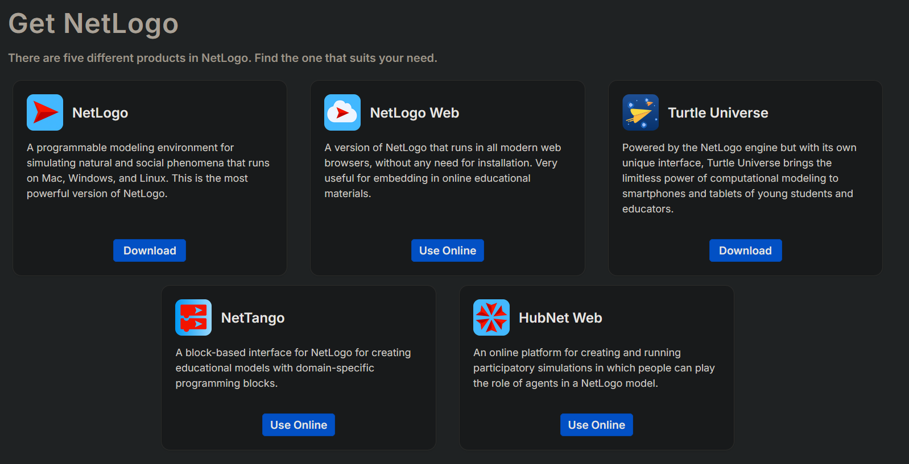

# Guia NetLogo

[← Voltar ao índice](../../README.md) · [Guia GAMA Platform](../gama/guias.md)

## Sumário

- [Download da Ferramenta](#download-da-ferramenta)
- [Versões Disponíveis](#versões-disponíveis)
- [Guia de Uso](#guia-de-uso)
- [Configuração](#configuração)
- [Primeiros Passos](#primeiros-passos)
  - [Estrutura Básica](#estrutura-básica)
  - [Código Exemplo](#código-exemplo)
- [Documentação Oficial](#documentação-oficial)

## Download da Ferramenta

Baixe o NetLogo no [site oficial](https://www.netlogo.org/download/). O site do NetLogo foi migrado para o domínio `netlogo.org`; os endereços antigos em `ccl.northwestern.edu/netlogo/` continuam funcionando apenas por redirecionamento.



> **NetLogo 7.** A versão 7.0 foi lançada em setembro de 2025 e trouxe mudanças relevantes: interface modernizada com temas claro, escuro e clássico; novas ferramentas de edição de widgets; e, principalmente, um **novo formato de arquivo `.nlogox`** (baseado em XML) que substitui o antigo `.nlogo`. Modelos antigos continuam abrindo normalmente — são convertidos para `.nlogox`, e o NetLogo 7 salva apenas nesse novo formato. As abas Interface, Info e Code permanecem as mesmas.

## Versões Disponíveis

- **NetLogo Desktop**
  Versão padrão em formato de software, executada localmente.

- **[NetLogo Web](https://www.netlogoweb.org/launch)**
  Versão web do NetLogo padrão, executada diretamente do navegador.

- **[Turtle Universe](https://www.turtlesim.com/products/turtle-universe/)**
  Versão para smartphones e tablets (iOS, Android e Chrome OS), também disponível como pacote independente para Windows e macOS. Usa o motor do NetLogo com interface própria e abre a maioria dos modelos NetLogo, NetLogo Web e NetTango. Permite aprender fenômenos sociais e científicos através de representações interativas e micro mundos.

- **[NetTango](https://ccl.northwestern.edu/nettangoweb/)**
  Interface baseada em blocos para o NetLogo Web. Focada na criação de modelos educacionais com blocos de programação específicos.

- **[HubNet Web](https://hubnetweb.org/)**
  Plataforma online para criar e executar simulações participativas, onde usuários atuam como agentes no modelo.

## Guia de Uso

A interface principal do NetLogo é dividida em três abas fundamentais, essenciais para a navegação e desenvolvimento dos modelos:

- Interface: É o painel de controle e visualização. Contém o ambiente simulado (View) e os widgets de controle interativos, como botões (Buttons), controles deslizantes (Sliders), interruptores (Switches) e gráficos (Plots). Abaixo da área de visualização fica o Command Center, utilizado para enviar instruções diretas aos agentes em tempo real.

[add image]

- Info: Um editor de texto rico utilizado para documentar o modelo. Segue um padrão de tópicos (O que é o modelo?, Como funciona?, Como usar?) e suporta formatação em Markdown. É a documentação interna do modelo, usada para descrever as regras da simulação — não é exigida para executar o modelo, mas é a prática recomendada em todos os modelos da biblioteca oficial.

[add image]

- Code: A IDE (Integrated Development Environment) nativa do NetLogo. Onde o código-fonte da simulação é escrito. Possui recursos de destaque de sintaxe, verificação de erros e numeração de linhas.

[add image]

## Configuração

A configuração do ambiente de simulação dita as regras espaciais e temporais do modelo. Estas configurações são acessadas através do botão "Settings..." na aba Interface.

- Topologia e Dimensões (World): O ambiente é um grid de coordenadas. A janela de configurações permite definir as fronteiras máximas e mínimas nos eixos X e Y (min-pxcor, max-pxcor, min-pycor, max-pycor).

- World Wrap (Torus): Opções que definem se o mundo tem bordas rígidas ou se conecta topologicamente em um cilindro ou toro (se um agente sai pela direita, reaparece pela esquerda). Por padrão, as duas direções vêm marcadas — ou seja, o mundo é um toro e nenhum agente se perde fora da área visível. É uma diferença importante em relação ao [GAMA](../gama/guias.md#configuração), onde o padrão é o oposto.

- Patch Size: Define o tamanho em pixels de cada célula (patch) na tela, afetando a resolução e o tamanho visual do ambiente sem alterar a lógica matemática.

- Velocidade de Execução (Speed Slider): Um controle deslizante na barra superior da Interface que acelera ou desacelera a renderização visual da simulação.

## Primeiros Passos

O fluxo inicial de trabalho no NetLogo geralmente envolve a exploração da Models Library (Biblioteca de Modelos) antes do desenvolvimento de código próprio.

- Acessar a Biblioteca: Vá em File > Models Library. A biblioteca contém dezenas de modelos pré-programados divididos por áreas do conhecimento (Biologia, Redes, Ciências Sociais, Matemática).

- Carregar um Modelo: Selecione um modelo (por exemplo, Biology > Wolf Sheep Predation) e clique em Open.

- Inicialização (Setup): Na aba Interface, localize o botão rotulado setup. Este botão executa o bloco de código que limpa a memória, desenha o ambiente inicial e posiciona os agentes no estado zero da simulação.

- Execução (Go): Clique no botão go. Em modelos padrão, este é um botão de iteração contínua (representado por um ícone de ciclo negro). Ele instrui o tempo a avançar, fazendo os agentes executarem suas regras de comportamento repetidamente.

### Estrutura Básica

A linguagem do NetLogo é construída sobre quatro tipos fundamentais de agentes operacionais. Compreender esta estrutura é o núcleo da programação multiagente na ferramenta.

- Observer (Observador): O controlador global. O observador não tem corpo físico no mundo, mas pode criar os outros agentes, alterar variáveis globais e controlar o fluxo do tempo.

- Turtles (Tartarugas): Agentes móveis. Eles possuem coordenadas (xcor, ycor), direção (heading), cor e podem se mover pelo espaço. Podem representar pessoas, animais, veículos ou nós em uma rede móvel.

- Patches (Células): Agentes estacionários que formam o plano de fundo. O mundo é um grid bidimensional de patches. Cada patch tem coordenadas inteiras (pxcor, pycor) e pode conter variáveis próprias (como altitude, quantidade de alimento ou poluição).

- Links (Ligações): Agentes conectores. Criam grafos e redes conectando duas turtles. Podem ser direcionados ou não-direcionados e são utilizados para simular redes sociais, rotas ou topologias de comunicação.

### Código Exemplo

O paradigma de codificação do NetLogo baseia-se em procedimentos (procedures), indicados pelas palavras-chave to e end. Um modelo exige estruturalmente um procedimento de inicialização e um procedimento de execução contínua baseada em tempo (ticks).

Abaixo, um modelo funcional e minimalista de caminhada aleatória (random walk):

```netlogo
;; Declaração do procedimento de inicialização
to setup
  clear-all                  ;; Limpa todo o ambiente, agentes e memória

  create-turtles 100 [       ;; O observador cria 100 agentes móveis
    setxy random-xcor random-ycor ;; Posiciona o agente em um local aleatório do mundo
    set color red            ;; Define a cor da turtle
  ]

  reset-ticks                ;; Zera o relógio interno da simulação, permitindo que os gráficos iniciem
end

;; Declaração do procedimento de execução
to go
  ask turtles [              ;; O observador ordena que todas as turtles executem os comandos internos
    right random 360         ;; Altera a direção atual aleatoriamente entre 0 e 359 graus
    forward 1                ;; Move a turtle um patch na direção atual
  ]

  tick                       ;; Avança o tempo da simulação em 1 unidade
end
```

[add imagem da simulação]

Para rodar o modelo, o código sozinho não basta: é preciso criar na aba Interface dois botões (`Button`) associados aos procedimentos `setup` e `go`, marcando a opção *Forever* no botão `go` para que ele itere continuamente.

Repare que nenhum comando impede a turtle de sair do mundo — isso não é necessário porque o mundo do NetLogo é um toro por padrão, e o agente reaparece do lado oposto. O modelo equivalente em [GAMA](../gama/guias.md#código-exemplo) precisa tratar esse limite explicitamente.

## Documentação Oficial

- [NetLogo User Manual](https://docs.netlogo.org/)
- [NetLogo Dictionary](https://docs.netlogo.org/dictionary) — referência de todas as primitivas
- [Site oficial](https://www.netlogo.org/) — downloads, tutoriais e Modeling Commons
